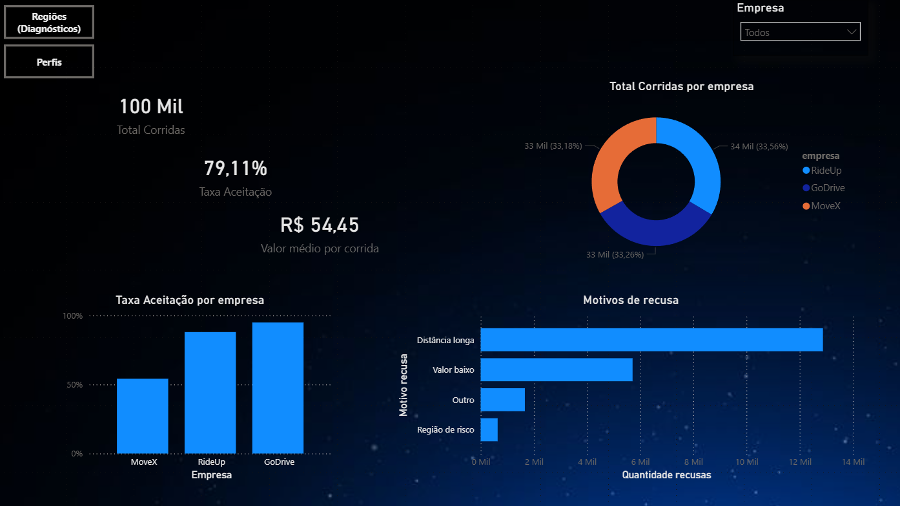
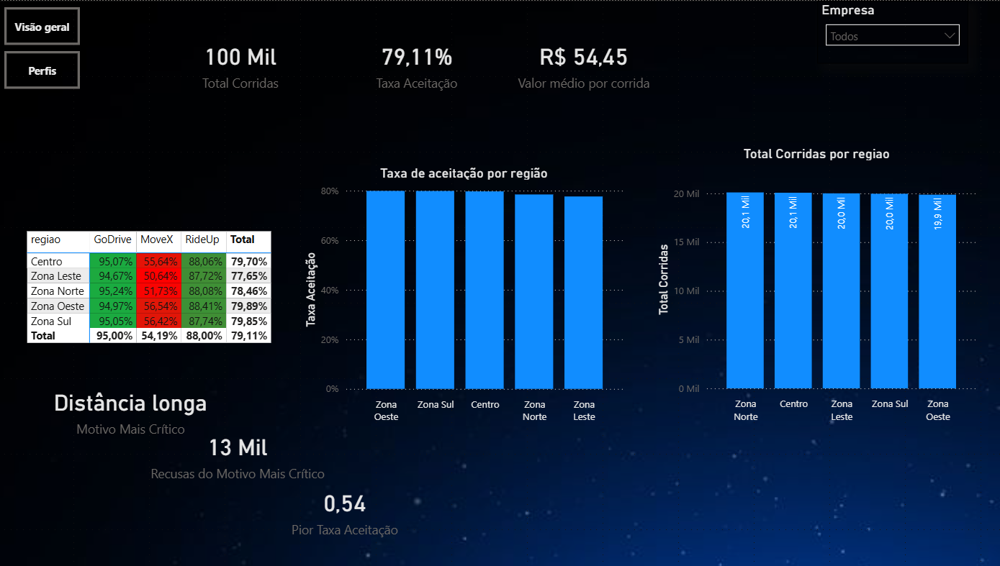
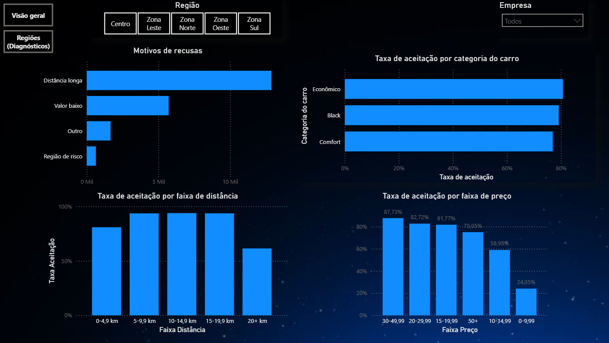

# motorista-app

Projeto de portfólio com um cenário operacional de mobilidade para analisar aceitação de corridas, recusas e padrões por empresa/região, usando SQL Server (SSMS) e Power BI.

## Contexto
A ideia aqui é simular uma rotina bem comum em times de Operações/Produto: entender **por que a taxa de aceitação cai**, onde estão os **pontos críticos** e como isso afeta a experiência (motoristas/usuários).

Os dados são simulados e foram gerados para reproduzir situações reais (ex.: empresas com performance diferente, regiões com comportamento distinto e motivos de recusa recorrentes).

## Pipeline (do começo ao fim)
1. **Geração do CSV** no Python (Google Colab), com apoio de IA para acelerar a criação do dataset.
2. **Carga, tratamento e análises no SQL Server (SSMS)**: consultas, agregações e criação de visões para consumo no BI.
3. **Dashboard no Power BI**: modelagem + medidas em DAX e construção das páginas (Visão geral, Regiões, Perfis).

## O que você encontra neste repositório
- `motorista-app.pbix` → arquivo do Power BI
- `images/` → prints das páginas do dashboard e evidências do SQL (queries/resultados)
- `sql/` → scripts com as consultas usadas nas análises

## Dashboard (prints)
As páginas abaixo mostram o fluxo de análise do projeto:

### Página 1 — Visão geral

### Página 2 — Regiões (Diagnósticos)

### Página 3 — Perfis

## Consultas SQL (SSMS)
As consultas estão separadas por arquivos na pasta `sql/`.  
Sugestão de leitura: comece pelos KPIs e depois vá para os recortes (empresa, região, motivo, distância e preço).

- `sql/01_kpis_gerais.sql`
- `sql/02_aceitacao_por_empresa.sql`
- `sql/03_recusas_por_motivo.sql`
- `sql/04_aceitacao_por_regiao.sql`
- `sql/05_aceitacao_por_faixa_distancia.sql`
- `sql/06_aceitacao_por_faixa_preco.sql` (se você usar)

## Tecnologias usadas
- SQL Server / SSMS (consultas, tratamento e agregações)
- Power BI (modelagem, DAX e visualização)
- Python (Google Colab) para gerar o dataset base

## Como abrir
1. Baixe o arquivo `motorista-app.pbix`
2. Abra no Power BI Desktop
3. Caso apareça aviso de fonte de dados, aponte para o arquivo CSV (se você também subir o CSV aqui no repo)

## Autor
Michael Andrade  
GitHub: https://github.com/whatevermic  
LinkedIn: https://www.linkedin.com/in/michaelgsandrade/
